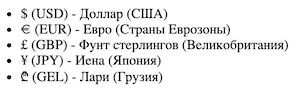
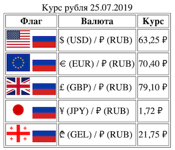

## Знакомство с `<ul>`, `<table>`,
Теперь ты можешь выполнить свою первую практическую задачу. При помощи HTML можно создавать списки, блоки, таблицы, и другие элементы разметки страницы. 

Сейчас тебе предстоит освоить работу со списками. С помощью списка можно сделать список задач на день или перечень покупок в супермаркете. Нужно будет сделать перечень валют при помощи ненумерованного списка. Достаточно использовать 4-5 различных валют. Тебе пригодятся следующие теги: `<ul>`, `<li>`.

Подробнее познакомиться с маркированными списками можно [тут](http://htmlbook.ru/html/ul).

Так же тебе предстоит освоить работу с таблицами. Этот элемент применяется достаточно часто. Сверстай таблицу "Курс валют на сегодня". Используй валюты, которые есть в твоём списке. Используй картинки. Тебе пригодятся следующие теги: `<table>`, `<tr>`, `<td>`, ``.
       
Подробнее познакомиться с таблицами можно [тут](http://htmlbook.ru/html/table).

Работай в файле `index.html`.

*Помни: каждый релиз = отдельный коммит (commit).*

### Релиз 0.
Создай ненумерованный список из разных валют.

Пример списка:

### Релиз 1.
Сделай таблицу, в которой будет 2 колонки: валюта, курс на сегодня.

### Релиз 2.
Добавь 3-ю колонку с изображениями флагов стран, валюты которых рассматриваются в соответствующей строке.

Пример таблицы:

*Отлично! Теперь сделай "Pull request" своего проекта прежде, чем приступать к следующему заданию.*
