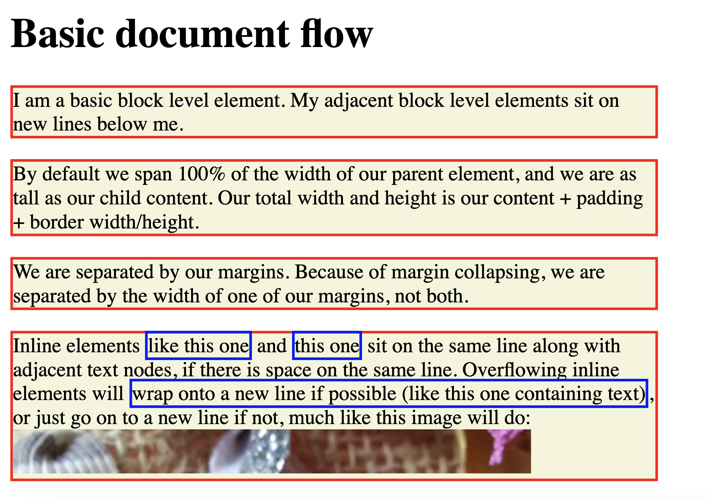

## CSS-box-model 

В данном задании мы познакомимся с так называемой box model.  

Перед началом работы стоит повторить теорию: [box-model](css-box-model.pdf).  

### Релиз 0.

У тебя уже есть готовый файл `index.html`, к нему требуется прикрепить файл `style.css`.  

Для этого создайте файл `style.css`. Добавьте в `index.html` соответсвующий линк на внешний лист css. (см. подсказу в презентации)

### Релиз 1.
Изучи файл `index.html`, но **не делай в нем никаких изменений**. Все изменения мы будем делать через css файл, используя селеторы.

(подсказки: не забудьте про background-color, border: solid)

Нужно добиться результата похожего на пример ниже:  

