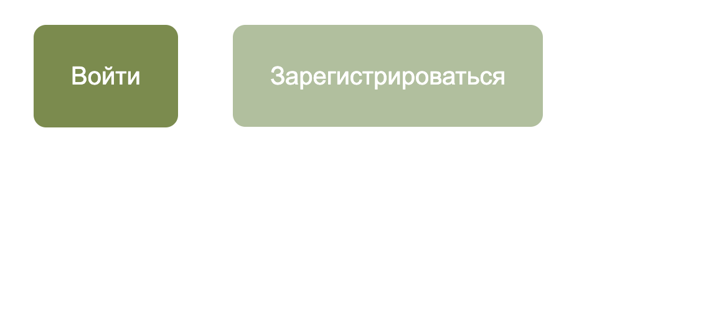
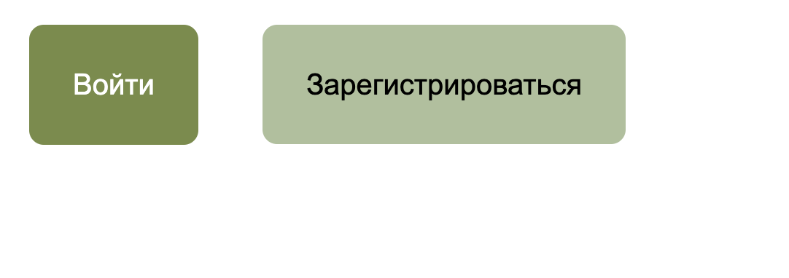

## CSS-box-model 

В данном задании мы создадим две прекрасные кнопки.  

### Релиз 0.

У тебя уже есть готовый файл `index.html`. Не меняй его, работай только с файлом css 

Требуется создать кнопки как на изображении:

Тебе пригодятся следующие цвета: #778D45 - это темно-зеленый, #AEC09A - светло-зеленый.  

Обрати внимание, что в index.html один элемент - это `<button>`, а другой - это `<а>`. Это не является ошибкой, при помощи css мы сможем сделать, чтобы они выглядели единообразно.

Убрать внешнюю границу у кнопки можно при помощи `border: none;`
Также могут быть полезны следующие свойства:  `font-size, font-family, border-radius, margin, color, background-color, padding`

### Релиз 1. * дополнительный

Попробуем сделать дизайн интереснее, чтобы при наведении курсора, цвет текста менялся на черный. 
Сделать это можно при помощи псевдоселектора `:hower`.  

Например, `p:hower {color:red;}` - красный цвет будет применяться к тексту параграфа только при наведении курсора.

