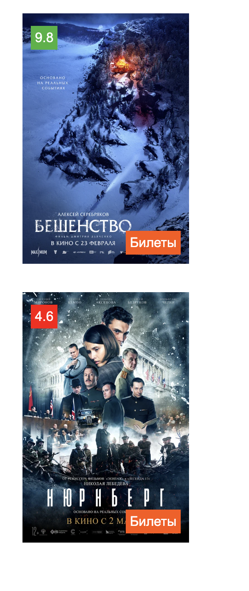

## Position. `Movie card, кинопоиск`

_В данном задании мы поработаем с позиционированием и сделаем карточку для фильма._  

### Релиз 0.

У тебя уже есть два пустых файла `index.html` и `style.css`.  

Ты также можешь найти два изображения `movie1.webp` и `movie1.webp` внтури папки проекта (их пропорция 900Х600).

Если хочешь сделать, чтобы div совпадал по размерам со внутренним изображением, можно использовать:
- width: fit-content;;
- height: fit-content;

### Релиз 1.

Создай div под карточку, положи в него изображение и div с оценкой фильма.  

Цвета оценки: зеленый `rgb(59,179,58)`, красный `rgb(255,0,0)`.  

Не забудь про то, что мы изучили на занятии. Подумай, о том какой position задать ребенку, а какой родителю. 
_В конце релиза сделай commit._

### Релиз 2.

Теперь можешь добавить еще один div c надписью билеты.  
Его цвет `rgb(255,86,0)`.

Не забудь про padding, margin, шрифты и их цвет, 

_В конце релиза сделай commit, push и pull request._ 